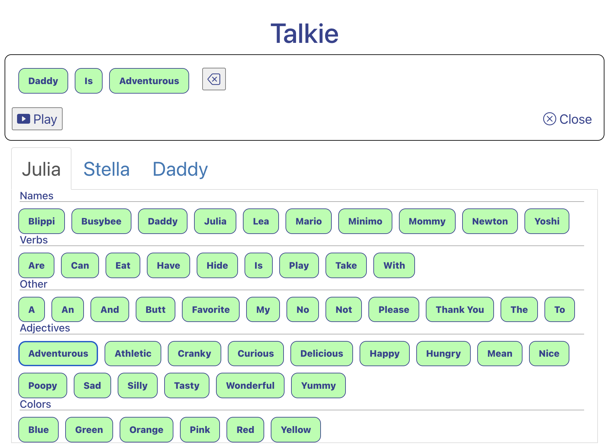

# Talkie

[Demo](https://talkie.mlodzianoski.com)

This is a toy for my kids (ages 5yo and 3yo). There is a list of words, when you press on the word you hear a voice saying the word. You can build sentences and play them back.

This is a PWA (Progressive Web App). It works on the web and can be installed on a mobile device.

## How to Play
0. Play it here: [talkie.mlodzianoski.com](https://talkie.mlodzianoski.com)
1. Click a voice (Julia, Stella, etc).
2. There is a list of words. Click a word to hear that voice say it.
3. Record a sentence:
4. Tab "Begin Recording"
5. Tap words, you'll see the sentence being built.
6. Tab "Play" and you'll hear the sentence you built!

## Screenshot

## Available Scripts

### `npm start`
### `npm test`
### `npm build`

## Bugs
1. There is a styling bug on the action buttons for Safari after install.
2. Sounds sometimes unregister. Reproduce: on iphone, on installed PWA, open the app. Click sounds, they work. Then switch away from app. Switch back to app. Click a sound, it does not play.

## Future Work
[ ] Add "Favorites" functionality for sentences. Include a star icon, tapping it will save it locally. Include a star tab with the voices; this tab will list all saved sentences.
[ ] Add more words (audio).
[x] Refactor SoundData into testable components
[ ] Refactor jsx inside Talkie to be smaller components, easier to test
[ ] Add more tests
